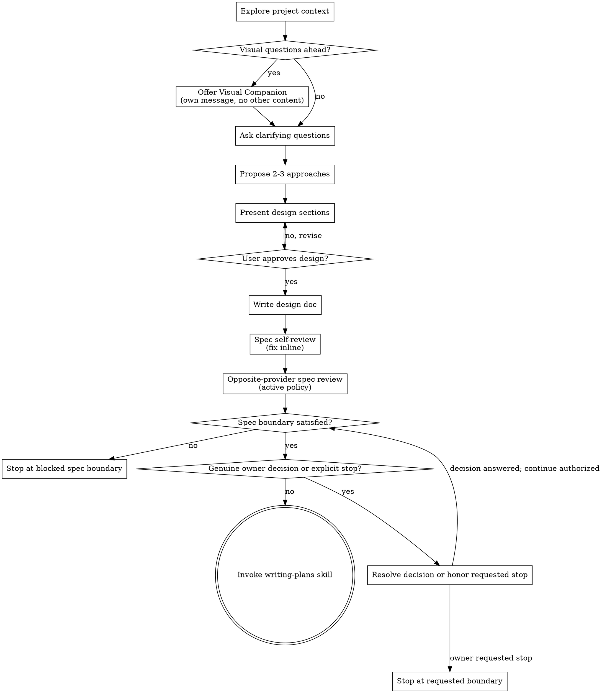

# Brainstorming Ideas Into Designs

Help turn ideas into fully formed designs and specs through natural collaborative dialogue.

## Workflow policy router

If loaded repository guidance declares `joshix-workflow-policy:`, read
`../using-joshix/references/workflow-policy.md` first. For `trivial`, skip this
skill. For `routine`, use it only when the single selected artifact is a short
design note, unless the user explicitly requests both artifacts. For `complex`,
continue below. Before the full design gate, apply this exception with or without
a policy: mechanical work with settled behavior defaults to the short-planning
branch in `joshix:writing-plans`. File count and criticality alone do not require
full design. An explicit request for spec plus plan receives both, kept concise,
with required artifact reviews; do not reopen settled design to fill a checklist.

### Routine design-note terminal

When an active declaration says `routine` and selects a design note as the one
planning artifact:

1. Inspect the relevant project context and identify the one uncertainty the
   note must settle.
2. Follow established repository policy for dev-level instances; bubble only
   a genuinely new or ambiguous product or policy choice.
3. Write one short note with outcome, authorized scope, chosen approach, and
   focused verification. Do not create a brainstorm, spec, or plan.
4. Self-review the note for ambiguity and scope expansion, then return to the
   coordinator. Do not continue into the legacy hard gate, checklist, process,
   spec review, or writing-plans transition below.

If execution is not already authorized, end with the exact execution readiness
hold from the review response contract.

For genuine owner decisions, read and follow
`../using-joshix/references/owner-question-format.md` for the exact rendered
question, spacing, choices, and waiting behavior.

Start by understanding the current project context, then ask questions one at a time to refine the idea. Once you understand what you're building, present the design and get user approval.

<HARD-GATE>
Do NOT invoke any implementation skill, write any code, scaffold any project, or take any implementation action until you have presented a design and the user has approved it. Apply this full-design gate when design is unresolved; settled mechanical work follows the short-planning exception above.
</HARD-GATE>

The hard gate and remaining detailed sections apply to nonmechanical `complex`
and policy-absent work; they do not override the short-planning exception.

## Anti-Pattern: "This Is Too Simple To Need A Design"

Small changes with unresolved behavior still need design. Settled mechanical work uses the short-planning exception. "Simple" projects are where unexamined assumptions cause the most wasted work. The design can be short (a few sentences for truly simple projects), but you MUST present it and get approval.

## Checklist

You MUST create a task for each of these items and complete them in order:

1. **Explore project context** — check files, docs, recent commits
2. **Offer visual companion** (if topic will involve visual questions) — this is its own message, not combined with a clarifying question. See the Visual Companion section below.
3. **Ask clarifying questions** — one at a time, understand purpose/constraints/success criteria
4. **Propose 2-3 approaches** — with trade-offs and your recommendation
5. **Present design** — in sections scaled to their complexity, get user approval after each section
6. **Write design doc** — save to `.joshix/specs/YYYY-MM-DD-<topic>-design.md`
7. **Spec self-review** — quick inline check for placeholders, contradictions, ambiguity, scope (see below)
8. **Opposite-provider spec review** — with an active workflow policy, review the written spec through `../using-joshix/references/autonomous-review.md`
9. **Resolve genuine owner decisions** — honor explicit spec-only, review-only, or stop instructions; no routine extra written-spec signoff
10. **Continue to planning automatically** — after required spec reviews and genuine decisions, invoke writing-plans without another planning command

## Progress DAG

When this top-level workflow has at least three tracked nodes, follow the
canonical trigger, rendering, state, topology, and update rules in
`../using-joshix/references/progress-dag.md`.

## Process Flow

**Continue into writing-plans when its boundary is satisfied and no explicit stop applies.** Otherwise report the blocking boundary or requested stop. Do NOT invoke frontend-design, mcp-builder, or any other implementation skill. The ONLY next phase after brainstorming is writing-plans.

## The Process

**Understanding the idea:**

- Check out the current project state first (files, docs, recent commits)
- Before asking detailed questions, assess scope: if the request describes multiple independent subsystems (e.g., "build a platform with chat, file storage, billing, and analytics"), flag this immediately. Don't spend questions refining details of a project that needs to be decomposed first.
- If the project is too large for a single spec, help the user decompose into sub-projects: what are the independent pieces, how do they relate, what order should they be built? Then brainstorm the first sub-project through the normal design flow. Each sub-project gets its own spec → plan → implementation cycle.
- For appropriately-scoped projects, ask questions one at a time to refine the idea
- Prefer multiple choice questions when possible, but open-ended is fine too
- Only one question per message - if a topic needs more exploration, break it into multiple questions
- Focus on understanding: purpose, constraints, success criteria

**Exploring approaches:**

- Propose 2-3 different approaches with trade-offs
- Present options conversationally with your recommendation and reasoning
- Lead with your recommended option and explain why

**Presenting the design:**

- Once you believe you understand what you're building, present the design
- Scale each section to its complexity: a few sentences if straightforward, up to 200-300 words if nuanced
- Ask after each section whether it looks right so far
- Cover: architecture, components, data flow, error handling, testing
- Be ready to go back and clarify if something doesn't make sense

**Design for isolation and clarity:**

- Break the system into smaller units that each have one clear purpose, communicate through well-defined interfaces, and can be understood and tested independently
- For each unit, you should be able to answer: what does it do, how do you use it, and what does it depend on?
- Can someone understand what a unit does without reading its internals? Can you change the internals without breaking consumers? If not, the boundaries need work.
- Smaller, well-bounded units are also easier for you to work with - you reason better about code you can hold in context at once, and your edits are more reliable when files are focused. When a file grows large, that's often a signal that it's doing too much.

**Working in existing codebases:**

- Explore the current structure before proposing changes. Follow existing patterns.
- Where existing code has problems that affect the work (e.g., a file that's grown too large, unclear boundaries, tangled responsibilities), include targeted improvements as part of the design - the way a good developer improves code they're working in.
- Don't propose unrelated refactoring. Stay focused on what serves the current goal.

## After the Design

**Documentation:**

- Write the validated design (spec) to `.joshix/specs/YYYY-MM-DD-<topic>-design.md`
  - (User preferences for spec location override this default)
- Use elements-of-style:writing-clearly-and-concisely skill if available
- Treat `.joshix/specs/` files as planning artifacts, not canonical docs. Durable
  decisions should move into repo documentation or product docs when the work is
  implemented.

**Spec Self-Review:**
After writing the spec document, look at it with fresh eyes:

1. **Placeholder scan:** Any "TBD", "TODO", incomplete sections, or vague requirements? Fix them.
2. **Internal consistency:** Do any sections contradict each other? Does the architecture match the feature descriptions?
3. **Scope check:** Is this focused enough for a single implementation plan, or does it need decomposition?
4. **Ambiguity check:** Could any requirement be interpreted two different ways? If so, pick one and make it explicit.

Fix any issues inline. No need to re-review — just fix and move on.

**Opposite-Provider Spec Review:**
With an active workflow policy, unless an explicit owner or repository
instruction names the spec boundary, review the written spec through
`../using-joshix/references/autonomous-review.md` after self-review and before
planning begins. Apply the existing reception and
semantic stopping rules; a fresh review requires a material correction or new
evidence. Policy absence preserves the existing spec-review workflow.

When a delegated spec reviewer is used, use the template at
`../reviewing-specs/spec-document-reviewer-prompt.md`.

**Spec-to-Plan Continuation:**
If the active-policy core spec review is not approved and no explicit owner or
repository instruction names the spec boundary, report `Spec boundary blocked:
opposite-provider approval is absent and no explicit owner or repository
instruction names the spec boundary.` and stop before planning.

After the required spec reviews and genuine owner decisions are satisfied,
continue directly into writing-plans. Do not request a separate planning command
or routine written-spec signoff. Explicit spec-only, review-only, or stop
instructions remain effective; report the requested stopping point plainly.
If changes are requested, apply them and review material corrections and their
consequences under the existing review contracts. Clarifications do not restart
broad design review. Required provider approval still must be present.
Implementation authorization remains separate from planning.

**Implementation:**

- Invoke the writing-plans skill to create a detailed implementation plan
- Do NOT invoke any other skill. writing-plans is the next step.

## Key Principles

- **One question at a time** - Don't overwhelm with multiple questions
- **Multiple choice preferred** - Easier to answer than open-ended when possible
- **YAGNI ruthlessly** - Remove unnecessary features from all designs
- **Explore alternatives** - Always propose 2-3 approaches before settling
- **Incremental validation** - Present design, get approval before moving on
- **Be flexible** - Go back and clarify when something doesn't make sense

## Visual Companion

A browser-based companion for showing mockups, diagrams, and visual options during brainstorming. Available as a tool — not a mode. Accepting the companion means it's available for questions that benefit from visual treatment; it does NOT mean every question goes through the browser.

**Offering the companion:** When you anticipate that upcoming questions will involve visual content (mockups, layouts, diagrams), offer it once for consent:
> "Some of what we're working on might be easier to explain if I can show it to you in a web browser. I can put together mockups, diagrams, comparisons, and other visuals as we go. This feature is still new and can be token-intensive. Want to try it? (Requires opening a local URL)"

**This offer MUST be its own message.** Do not combine it with clarifying questions, context summaries, or any other content. The message should contain ONLY the offer above and nothing else. Wait for the user's response before continuing. If they decline, proceed with text-only brainstorming.

**Per-question decision:** Even after the user accepts, decide FOR EACH QUESTION whether to use the browser or the terminal. The test: **would the user understand this better by seeing it than reading it?**

- **Use the browser** for content that IS visual — mockups, wireframes, layout comparisons, architecture diagrams, side-by-side visual designs
- **Use the terminal** for content that is text — requirements questions, conceptual choices, tradeoff lists, A/B/C/D text options, scope decisions

A question about a UI topic is not automatically a visual question. "What does personality mean in this context?" is a conceptual question — use the terminal. "Which wizard layout works better?" is a visual question — use the browser.

If they agree to the companion, read the detailed guide before proceeding:
`skills/brainstorming/visual-companion.md`
