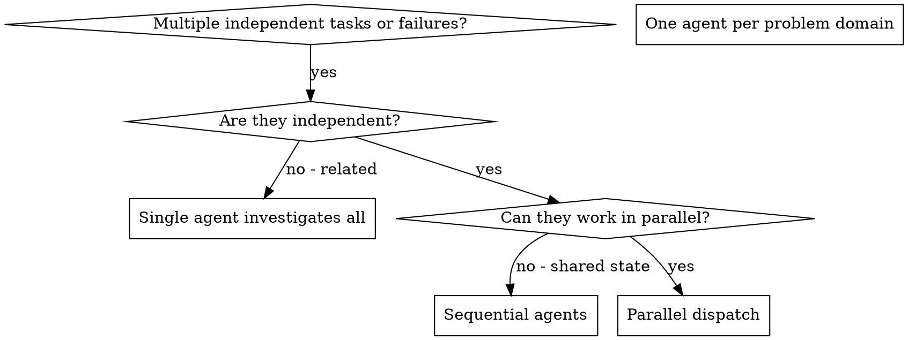

# Dispatching Parallel Agents

## Overview

You delegate tasks to specialized agents with focused context. By precisely
crafting their instructions and context, you help them stay focused and succeed
at their task. By default, provide only the relevant context instead of
inheriting the entire session history. Inherit or fork session context only when
the platform or task genuinely requires it. This also preserves your own context
for coordination work.

When you have multiple unrelated failures (different test files, different subsystems, different bugs), investigating them sequentially wastes time. Each investigation is independent and can happen in parallel.

**Core principle:** Dispatch one agent per independent problem domain. Let them work concurrently.

## Model Selection

Use the current/default model for delegated work. Do not downgrade models to
conserve cost. If the platform inherits the current model by default, let that
cascade to subagents. Avoid overriding model selection unless the user, repo
guidance, or platform-specific workflow explicitly calls for a different model.

## When to Use



**Use when:**
- 2+ independent tasks or failures where parallelism is worth the coordination overhead
- Multiple subsystems broken independently
- Each problem can be understood without context from others
- Agents can work in disjoint read/write scopes

**Don't use when:**
- The latest user message contains an honest question that needs answering first
- Failures are related (fix one might fix others)
- Need to understand full system state
- Agents would interfere with each other
- Coordination overhead is larger than the expected speedup

## The Pattern

### 1. Identify Independent Domains

Group failures by what's broken:
- File A tests: Tool approval flow
- File B tests: Batch completion behavior
- File C tests: Abort functionality

Each domain is independent - fixing tool approval doesn't affect abort tests.

### 2. Create Focused Agent Tasks

Each agent gets:
- **Specific scope:** One test file or subsystem
- **Clear goal:** Make these tests pass
- **Allowed write scope:** Which files or areas may change, and whether
  production code, tests, or both are in scope
- **Expected output:** Summary of what you found and fixed

### 3. Dispatch in Parallel

Use the platform's subagent or task tool to start one worker per domain:

```markdown
Agent 1: Fix agent-tool-abort.test.ts failures
Agent 2: Fix batch-completion-behavior.test.ts failures
Agent 3: Fix tool-approval-race-conditions.test.ts failures
```

All three run concurrently because their scopes are independent.

### 4. Review and Integrate

When agents return:
- Read each summary
- Verify fixes don't conflict
- Run full test suite
- Integrate all changes

## Agent Prompt Structure

Good agent prompts are:
1. **Focused** - One clear problem domain
2. **Self-contained** - All context needed to understand the problem
3. **Specific about output** - What should the agent return?

```markdown
Fix the 3 failing tests in src/agents/agent-tool-abort.test.ts:

1. "should abort tool with partial output capture" - expects 'interrupted at' in message
2. "should handle mixed completed and aborted tools" - fast tool aborted instead of completed
3. "should properly track pendingToolCount" - expects 3 results but gets 0

These are timing/race condition issues. Your task:

1. Read the test file and understand what each test verifies
2. Identify root cause - timing issues or actual bugs?
3. Fix by:
   - Replacing arbitrary timeouts with event-based waiting
   - Fixing bugs in abort implementation if found
   - Adjusting test expectations if testing changed behavior

Do NOT just increase timeouts - find the real issue.

Return: Summary of what you found and what you fixed.
```

## Common Mistakes

**❌ Too broad:** "Fix all the tests" - agent gets lost
**✅ Specific:** "Fix agent-tool-abort.test.ts" - focused scope

**❌ No context:** "Fix the race condition" - agent doesn't know where
**✅ Context:** Paste the error messages and test names

**❌ No allowed write scope:** Agent might refactor everything
**✅ Clear write scope:** "You may edit src/abort.ts and its tests. Do not edit unrelated subsystems."

**❌ Vague output:** "Fix it" - you don't know what changed
**✅ Specific:** "Return summary of root cause and changes"

## When NOT to Use

**Related failures:** Fixing one might fix others - investigate together first
**Need full context:** Understanding requires seeing entire system
**Exploratory debugging:** You don't know what's broken yet
**Shared state:** Agents would interfere (editing same files, using same resources)
**Open user question:** The latest user message asks a real question that should be answered before taking action

## Example

**Scenario:** 6 test failures across 3 files after a refactor

**Independent domains:**
- agent-tool-abort.test.ts: 3 failures (timing issues)
- batch-completion-behavior.test.ts: 2 failures (tools not executing)
- tool-approval-race-conditions.test.ts: 1 failure (execution count = 0)

**Decision:** Independent domains - abort logic separate from batch completion separate from race conditions

**Dispatch:**
```
Agent 1 -> Fix agent-tool-abort.test.ts
Agent 2 -> Fix batch-completion-behavior.test.ts
Agent 3 -> Fix tool-approval-race-conditions.test.ts
```

**Results:**
- Agent 1: Replaced timeouts with event-based waiting
- Agent 2: Fixed event structure bug (threadId in wrong place)
- Agent 3: Added wait for async tool execution to complete

**Integration:** All fixes independent, no conflicts, full suite green

**Result:** 3 independent problems solved in the time of one, with one final
integration verification.

## Key Benefits

1. **Parallelization** - Multiple investigations happen simultaneously
2. **Focus** - Each agent has narrow scope, less context to track
3. **Independence** - Agents don't interfere with each other
4. **Speed** - 3 problems solved in time of 1

## Verification

After agents return:
1. **Review each summary** - Understand what changed
2. **Check for conflicts** - Did agents edit same code?
3. **Run full suite** - Verify all fixes work together
4. **Spot check** - Agents can make systematic errors

## Practical Limit

Parallel dispatch is useful only when the work saved is larger than the cost of
coordination, review, conflict checks, and final verification.
