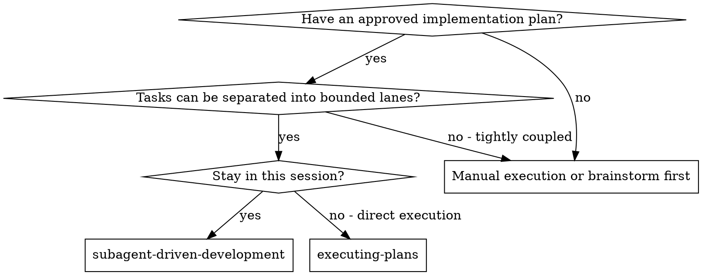

# Subagent-Driven Development

Execute an approved plan as dependency-aware lanes, with a fresh implementer
and two-stage review for each lane: spec compliance first, then code quality.

When two or more plan tasks are ready and potentially safe to overlap, invoke
`joshix:dispatching-parallel-agents` to classify, schedule, and report them.
Keep one coordinator free to own shared context, questions, integration, and
fresh verification. Do not duplicate capacity, wave, fallback, or timing rules
in this skill.

The top-level coordinator follows
`../using-joshix/references/progress-dag.md`. Dispatched workers do not render
DAGs. Do not duplicate the canonical threshold, state, styling, or update rules
here.

**Core principle:** Each lane owns a bounded scope and passes implementation,
verification, spec review, and quality review before its dependents advance.

**Continuous execution:** Do not pause to check in with the human partner
between tasks. Continue until all authorized work is complete, a blocker or
ambiguity genuinely prevents progress, or the user interrupts with an honest
question that must be answered first.

## When to Use

## The Process

1. Read the plan once; extract every task, `Depends on`, file/resource scope,
   verification command, and full task text.
2. Classify older tasks without `Depends on` conservatively.
3. Build the ready set from explicit dependencies and completed lane gates.
4. If two or more ready tasks may overlap safely, invoke
   `joshix:dispatching-parallel-agents`; otherwise run the ready task inline or
   serially.
5. For each lane: implementation and self-review → safe focused or deferred
   verification → spec-compliance review → code-quality review → fix and
   re-review loops.
6. Do not advance the same lane or its dependents while either required review
   has open issues. Unrelated lanes may continue.
7. When every lane passes, run serial integration, broad checks, final
   whole-change review, and `joshix:verification-before-completion`.

## Controller Rules

Create or update the task list from the one plan read. Give each worker the
complete task text and relevant scene-setting context; never make a worker read
the plan. Before dispatch, declare exclusive file and mutable-resource scope
and safe focused checks. Work in the current checkout and branch unless the
user explicitly requested a git operation.

Use a fresh role-specific worker for each lane's initial implementation, spec
review, and quality review. Return findings to the same implementer when
continuation is supported, then send the fixes through the corresponding
review gate again.

Use these exact descriptions for lane dispatches so coordination and transcript
evidence do not depend on free-form summaries:

- Implementer: `Implement Task N: <task name>`
- Spec reviewer: `Spec review Task N: <task name>`
- Quality reviewer: `Quality review Task N: <task name>`
- Final reviewer: `Whole-change review: <plan or feature>`

Keep the complete role-specific prompt from the corresponding template; the
description is stable metadata, not a replacement for that prompt.

For the final review, use the `joshix:requesting-code-review` template, replace
its generic dispatch description with the stable final-review description
above, and require exactly one final line:
`QUALITY OUTCOME: <APPROVED or CHANGES REQUIRED>`. Fix and re-review until the
outcome is `APPROVED`.

When an implementer returns, compare the files and mutable resources actually
touched with the declared scope before releasing dependents. Reviewer context
must include the lane's exact scope and lane-only change context, including
untracked files. Do not use an aggregate in-flight working-tree diff.

If a required broad or shared check was deferred, the coordinator owns it at
the first safe serialization point. The lane stays pre-review until the check
passes. On failure, classify it as lane-local or cross-lane, return it to the
responsible worker when continuation is supported (or dispatch a fully briefed
replacement), and repeat verification before review.

## Model Selection

Use the current/default model and reasoning effort for delegated work. Let host
inheritance cascade. Follow `joshix:dispatching-parallel-agents` for the
canonical inheritance rule and do not claim an effort level the host cannot
verify.

## Handling Implementer Status

Implementers report one of four statuses:

- **DONE:** Proceed to verification, then spec-compliance review.
- **DONE_WITH_CONCERNS:** Correctness, scope, or verification concerns remain
  pre-review; observational concerns may proceed after coordinator judgment.
- **NEEDS_CONTEXT:** Resume the same worker when supported or dispatch a fully
  briefed replacement.
- **BLOCKED:** Stop the lane and descendants; unrelated authorized lanes may
  continue. Escalate when approved context cannot resolve the blocker.

A before-start or mid-work question pauses only its lane unless it challenges
shared scope, architecture, interfaces, or assumptions. Never ignore an
escalation or retry the same prompt without changing context or task shape.

## Prompt Templates

- `./implementer-prompt.md` - implementation and self-review
- `./spec-reviewer-prompt.md` - spec-compliance review
- `./code-quality-reviewer-prompt.md` - code-quality review after spec passes

## Example Workflow

An approved plan has four tasks:

- Task 1 establishes a shared test contract (`Depends on: None`).
- Tasks 2 and 3 depend on Task 1, own disjoint files and resources, and have
  safe focused checks.
- Task 4 integrates the result and depends on Tasks 2 and 3.

The coordinator runs Task 1 through implementation, verification, spec review,
and quality review. After that lane passes, Tasks 2 and 3 enter the ready set.
The coordinator invokes `joshix:dispatching-parallel-agents`, gives each
implementer exclusive scope and a focused check, and observes each return.

If Task 2 reaches spec review while Task 3 is still implementing, both lanes
continue independently. A quality finding in Task 2 loops back within Task 2;
it does not stop Task 3. Task 4 waits until both lane gates pass. The
coordinator then runs Task 4 and serial integration, followed by broad checks,
whole-change review, and fresh completion verification.

## Quality Gates

- Keep spec-compliance review before code-quality review in every lane.
- The implementer fixes findings, and the corresponding reviewer re-reviews
  until the gate passes.
- Self-review never replaces either independent review.
- Do not advance the same lane or its dependents while either required review
  has open issues; unrelated lanes may proceed.
- Verify actual changed files and resources remain within declared scope.
- Preserve deferred checks for the first safe serialization point; never treat
  deferral as a pass.
- After all lanes pass, perform a final whole-change review.

## Red Flags

**Never:**

- Create or switch branches/worktrees unless the user explicitly requested it
- Skip spec-compliance or code-quality review
- Start code-quality review before spec-compliance review passes
- Accept open findings without a fix and re-review loop
- Make a worker read the plan instead of providing full task text
- Dispatch a worker without exclusive file/resource scope and verification
  ownership
- Review the aggregate in-flight working-tree diff instead of one lane
- Ignore questions, concerns, scope drift, or deferred verification
- Treat `.agents/specs/` or `.agents/plans/` as permanent documentation after
  implementation
- Clean up unrelated `.agents/` artifacts as incidental churn

## Integration

**Required workflow skills:**

- **joshix:writing-plans** - creates the dependency-annotated plan
- **joshix:dispatching-parallel-agents** - owns parallel classification,
  scheduling, shared-checkout safety, fallback, and reporting
- **joshix:requesting-code-review** - supplies the quality-review rubric
- **joshix:verification-before-completion** - requires fresh completion evidence

Implementers use **joshix:test-driven-development** for core behavior changes,
bug fixes, and other testable logic. Use **joshix:executing-plans** for direct
execution without subagent delegation.
