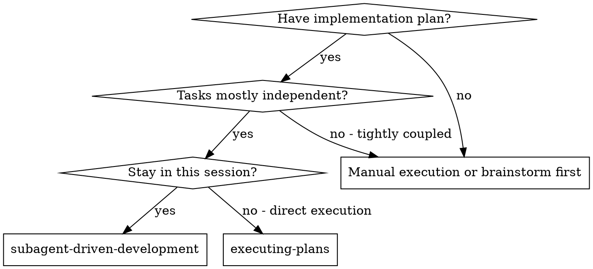
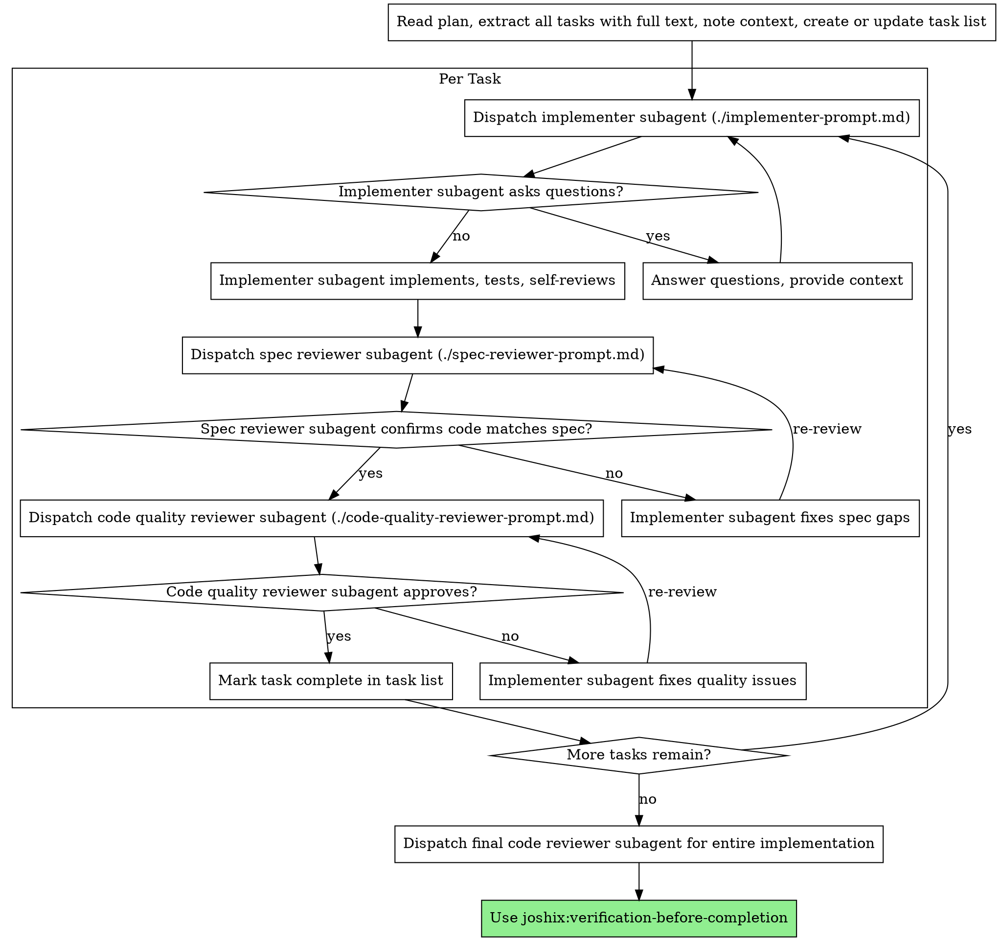

# Subagent-Driven Development

Execute plan by dispatching fresh subagent per task, with two-stage review after each: spec compliance review first, then code quality review.

**Why subagents:** You delegate tasks to specialized agents with focused
context. By precisely crafting their instructions and context, you help them
stay focused and succeed at their task. By default, provide only the relevant
context instead of inheriting the entire session history. Inherit or fork
session context only when the platform or task genuinely requires it. This also
preserves your own context for coordination work.

**Core principle:** Fresh subagent per task + two-stage review (spec then quality) = high quality, fast iteration

**Continuous execution:** Do not pause to check in with your human partner
between tasks. Execute all tasks from the plan without stopping. The only
reasons to stop are: BLOCKED status you cannot resolve, ambiguity that
genuinely prevents progress, a direct user interruption with an honest question
that needs an answer before continuing, or all tasks complete. "Should I
continue?" prompts and progress summaries waste their time — they asked you to
execute the plan, so execute it.

## When to Use



**vs. Executing Plans (direct execution):**
- Same session (no context switch)
- Fresh subagent per task (no context pollution)
- Two-stage review after each task: spec compliance first, then code quality
- Faster iteration (no human-in-loop between tasks)

## The Process



## Model Selection

Use the current/default model for delegated work. Do not downgrade models to
conserve cost. If the platform inherits the current model by default, let that
cascade to subagents. Avoid overriding model selection unless the user, repo
guidance, or platform-specific workflow explicitly calls for a different model.

## Handling Implementer Status

Implementer subagents report one of four statuses. Handle each appropriately:

**DONE:** Proceed to spec compliance review.

**DONE_WITH_CONCERNS:** The implementer completed the work but flagged doubts. Read the concerns before proceeding. If the concerns are about correctness or scope, address them before review. If they're observations (e.g., "this file is getting large"), note them and proceed to review.

**NEEDS_CONTEXT:** The implementer needs information that wasn't provided. Provide the missing context and re-dispatch.

**BLOCKED:** The implementer cannot complete the task. Assess the blocker:
1. If it's a context problem, provide more context and re-dispatch with the same model
2. If the task requires more reasoning, provide better context, split the task,
   or follow explicit user/repo/platform guidance for model selection
3. If the task is too large, break it into smaller pieces
4. If the plan itself is wrong, escalate to the human

**Never** ignore an escalation or force the same model to retry without changes. If the implementer said it's stuck, something needs to change.

## Prompt Templates

- `./implementer-prompt.md` - Dispatch implementer subagent
- `./spec-reviewer-prompt.md` - Dispatch spec compliance reviewer subagent
- `./code-quality-reviewer-prompt.md` - Dispatch code quality reviewer subagent

## Example Workflow

```
You: I'm using Subagent-Driven Development to execute this plan.

[Read plan file once: .agents/plans/feature-plan.md]
[Extract all 5 tasks with full text and context]
[Create or update the available task list with all tasks]

Task 1: Hook installation script

[Get Task 1 text and context (already extracted)]
[Dispatch implementation subagent with full task text + context]

Implementer: "Before I begin - should the hook be installed at user or system level?"

You: "User level (~/.config/joshix/hooks/)"

Implementer: "Got it. Implementing now..."
[Later] Implementer:
  - Implemented install-hook command
  - Added tests, 5/5 passing
  - Self-review: Found I missed --force flag, added it
  - Files changed: scripts/install-hook.sh, tests/install-hook.test.sh

[Dispatch spec compliance reviewer]
Spec reviewer: ✅ Spec compliant - all requirements met, nothing extra

[Get relevant diff context, dispatch code quality reviewer]
Code reviewer:
  Findings: None
  Recommendations: None
  Assessment: Ready to proceed

[Mark Task 1 complete in the task list]

Task 2: Recovery modes

[Get Task 2 text and context (already extracted)]
[Dispatch implementation subagent with full task text + context]

Implementer: [No questions, proceeds]
Implementer:
  - Added verify/repair modes
  - 8/8 tests passing
  - Self-review: All good
  - Files changed: src/recovery.js, tests/recovery.test.js

[Dispatch spec compliance reviewer]
Spec reviewer: ❌ Issues:
  - Missing: Progress reporting (spec says "report every 100 items")
  - Extra: Added --json flag (not requested)

[Implementer fixes issues]
Implementer: Removed --json flag, added progress reporting

[Spec reviewer reviews again]
Spec reviewer: ✅ Spec compliant now

[Dispatch code quality reviewer]
Code reviewer:
  Findings:
    Important: Magic number (100)
  Assessment: Ready to proceed with fixes

[Implementer fixes]
Implementer: Extracted PROGRESS_INTERVAL constant

[Code reviewer reviews again]
Code reviewer:
  Findings: None
  Assessment: Ready to proceed

[Mark Task 2 complete in the task list]

...

[After all tasks]
[Dispatch final code-reviewer]
Final reviewer:
  Findings: None
  Assessment: Ready to proceed

[Confirm durable repo docs were updated if the work changed product behavior,
architecture, operations, or developer workflow]
[Follow explicit closeout tasks for removing or archiving completed `.agents/`
artifacts]

Done!
```

## Advantages

**vs. Manual execution:**
- Subagents follow the plan's testing requirements, including TDD when the TDD
  skill applies
- Fresh context per task (no confusion)
- Parallel-safe (subagents don't interfere)
- Subagent can ask questions (before AND during work)

**vs. Executing Plans:**
- Same session (no handoff)
- Continuous progress (no waiting)
- Review checkpoints automatic

**Efficiency gains:**
- No file reading overhead (controller provides full text)
- Controller curates exactly what context is needed
- Subagent gets complete information upfront
- Questions surfaced before work begins (not after)

**Quality gates:**
- Self-review catches issues before handoff
- Two-stage review: spec compliance, then code quality
- Review loops ensure fixes actually work
- Spec compliance prevents over/under-building
- Code quality ensures implementation is well-built
- Durable repo docs capture decisions that should outlive `.agents/` artifacts

**Cost:**
- More subagent invocations (implementer + 2 reviewers per task)
- Controller does more prep work (extracting all tasks upfront)
- Review loops add iterations
- But catches issues early (cheaper than debugging later)

## Red Flags

**Never:**
- Create or switch branches/worktrees unless the user explicitly requested that git operation
- Skip reviews (spec compliance OR code quality)
- Proceed with unfixed issues
- Dispatch multiple implementation subagents in parallel (conflicts)
- Make subagent read plan file (provide full text instead)
- Skip scene-setting context (subagent needs to understand where task fits)
- Ignore subagent questions (answer before letting them proceed)
- Accept "close enough" on spec compliance (spec reviewer found issues = not done)
- Skip review loops (reviewer found issues = implementer fixes = review again)
- Let implementer self-review replace actual review (both are needed)
- **Start code quality review before spec compliance is ✅** (wrong order)
- Move to next task while either review has open issues
- Treat `.agents/specs/` or `.agents/plans/` as permanent documentation after
  implementation
- Clean up unrelated `.agents/` artifacts as incidental churn

**If subagent asks questions:**
- Answer clearly and completely
- Provide additional context if needed
- Don't rush them into implementation

**If reviewer finds issues:**
- Implementer (same subagent) fixes them
- Reviewer reviews again
- Repeat until approved
- Don't skip the re-review

**If subagent fails task:**
- Decide whether the right next step is local investigation, more context, a
  smaller task, or re-dispatching with specific fix instructions
- Do not blindly retry the same prompt after a subagent reports failure

## Integration

**Required workflow skills:**
- **joshix:writing-plans** - Creates the plan this skill executes
- **joshix:requesting-code-review** - Code review template for reviewer subagents
- **joshix:verification-before-completion** - Verify work before reporting completion

**Subagents should use:**
- **joshix:test-driven-development** - Subagents follow TDD for core behavior changes, bug fixes, and testable logic

**Alternative workflow:**
- **joshix:executing-plans** - Use for direct execution without subagent delegation
