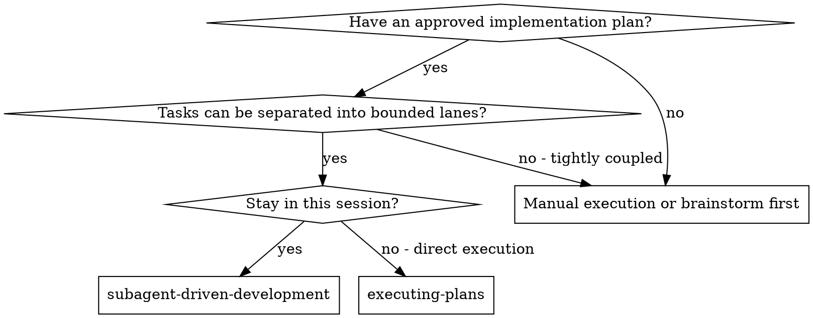

# Subagent-Driven Development

Execute an approved plan as dependency-aware lanes. With no workflow policy,
each lane needs a fresh implementer and approval for spec compliance and code
quality. The bridge route uses one review for both; the native route uses spec
review followed by quality review. With an active policy, the tier-defined
review rigor selects additional lane gates; the outer core final review still
runs once.

When two or more plan tasks are ready and potentially safe to overlap, invoke
`joshix:dispatching-parallel-agents` to classify, schedule, and report them.
Keep one coordinator free to own shared context, questions, integration, and
fresh verification. Do not duplicate capacity, wave, fallback, or timing rules
in this skill.

The top-level coordinator follows
`../using-joshix/references/progress-dag.md`. Dispatched workers do not emit
DAGs. Do not duplicate the canonical threshold, state, styling, or update rules
here.

**Core principle:** Each lane owns a bounded scope. Under policy absence it
passes implementation, verification, and spec and quality approval before
its dependents advance. Under an active policy it passes the focused checks and
additional lane review gates selected by the task-level tier.

**Continuous execution:** Do not pause to check in with the human partner
between tasks. Continue until all authorized work is complete, a blocker or
ambiguity genuinely prevents progress, or the user interrupts with an honest
question that must be answered first.

## When to Use

```dot
digraph when_to_use {
    "Have an approved implementation plan?" [shape=diamond];
    "Tasks can be separated into bounded lanes?" [shape=diamond];
    "Stay in this session?" [shape=diamond];
    "subagent-driven-development" [shape=box];
    "executing-plans" [shape=box];
    "Manual execution or brainstorm first" [shape=box];

    "Have an approved implementation plan?" -> "Tasks can be separated into bounded lanes?" [label="yes"];
    "Have an approved implementation plan?" -> "Manual execution or brainstorm first" [label="no"];
    "Tasks can be separated into bounded lanes?" -> "Stay in this session?" [label="yes"];
    "Tasks can be separated into bounded lanes?" -> "Manual execution or brainstorm first" [label="no - tightly coupled"];
    "Stay in this session?" -> "subagent-driven-development" [label="yes"];
    "Stay in this session?" -> "executing-plans" [label="no - direct execution"];
}
```

## The Process

If a workflow policy is active, the coordinator reads
`../using-joshix/references/workflow-policy.md` and owns scope, evidence,
review rigor, and progress-transition checks. Codex and Claude Code use
`../using-joshix/references/autonomous-review.md` for every selected review,
with or without a workflow policy. The coordinator calls the opposite provider;
implementation workers do not dispatch reviews. The native reviewer templates
and outcome lines below apply only to other hosts or an explicit owner override.
Before dispatch or the first implementation edit, apply the bootstrap's Work
and review rules to the supplied plan. Obtain advance approval only when that
review is selected or explicitly required by repository policy; reuse approval
for unchanged work. A required unresolved review blocks its dependent work,
not unrelated lanes. A settled plan alone creates no additional gate.
Workers receive the declaration needed for their lane but never write shared
task context. Slices use focused checks; the coordinator reserves full
completion gates for the end after review sign-off. A fresh review runs only
after material artifact change or new evidence. The coordinator stops on an
owner decision, repeated disagreement without new evidence, an unchanged
concrete defect, or the absence of an objective authorized correction.

1. Read the plan once; extract every task, `Depends on`, file/resource scope,
   verification command, and full task text.
2. Classify older tasks without `Depends on` conservatively.
3. Build the ready set from explicit dependencies and completed lane gates.
4. If two or more ready tasks may overlap safely, invoke
   `joshix:dispatching-parallel-agents`; otherwise run the ready task inline or
   serially.
5. Policy absent: for each lane, implementation and self-review → safe focused
   or deferred verification → spec-compliance and code-quality approval → fix
   and re-review when eligible. The bridge route uses one review for both;
   the native route uses spec-compliance review → code-quality review.
6. Active policy: for each lane, run focused verification and only the existing
   review gates required by the task-level tier. Do not add the legacy
   two-stage lane review by default.
7. Do not advance a lane or its dependents while a selected review gate has
   open issues. Unrelated lanes may continue when shared-checkout scheduling permits.
8. After every lane passes, run serial integration. When this skill is the
   first execution entry, it owns the one core whole-change review of the
   completed implementation plus any distinct tier-added gates unless an
   explicit owner or repository instruction names the completed-implementation
   boundary. Reuse a bridge approval already covering that completed scope and
   material state; do not duplicate it after the final lane. A lane-only review
   does not cover the whole-change scope. It then invokes `joshix:verification-before-completion` for
   broad/full completion verification once after review sign-off or that named
   override. Nested lanes never duplicate those task-level gates.

When entered from `executing-plans`, that caller remains outer and retains the
core final review. When entered from `executing-plans`, return after serial
integration and lane verification; the caller owns core review and full
completion verification. Parallel dispatch never takes ownership from its
caller.

## Controller Rules

Create or update the task list from the one plan read. Give each worker the
complete task text and relevant scene-setting context; never make a worker read
the plan. Before dispatch, declare exclusive file and mutable-resource scope
and safe focused checks. Work in the current checkout and branch unless the
user explicitly requested a git operation.

Use a fresh worker for each lane's initial implementation. Keep selected plan,
spec, quality, and whole-change reviews independent of the implementer. Codex
and Claude Code route these reviews through the opposite-provider bridge;
other hosts use fresh role-specific native reviewers.
Implementation workers remain lane-scoped. Return findings to the same
implementer when continuation is supported, then make a new explicit review
call only after the work materially changes or new evidence appears.
Coordinator-owned Codex and Claude Code reviewer calls use the installed
`joshix-review review` operation; workers
never invoke the bridge.

Use these exact descriptions for native lane dispatches so coordination and transcript
evidence do not depend on free-form summaries:

- Implementer: `Implement Task N: <task name>`
- Spec reviewer: `Spec review Task N: <task name>`
- Quality reviewer: `Quality review Task N: <task name>`
- Final reviewer: `Whole-change review: <plan or feature>`

Keep the complete role-specific prompt from the corresponding template; the
description is stable metadata, not a replacement for that prompt.

### Implementer return and deferred checks

When an implementer returns, compare the files and mutable resources actually
touched with the declared scope before releasing dependents. Reviewer context
must include the lane's exact scope and lane-only change context, including
untracked files. Do not use an aggregate in-flight working-tree diff.

If a required broad or shared check was deferred, the coordinator owns it at
the first safe serialization point. The lane stays pre-review until the check
passes. On failure, classify it as lane-local or cross-lane, return it to the
responsible worker when continuation is supported (or dispatch a fully briefed
replacement), and repeat verification before review.

### Native final reviewer template — other hosts or explicit owner override

On other hosts, or under an explicit owner override selecting native reviewers,
when the workflow requires final review, use the
`joshix:requesting-code-review` template, replace
its generic dispatch description with the stable final-review description
above. Without an active policy, require exactly one final line:
`QUALITY OUTCOME: <APPROVED or CHANGES REQUIRED>`. Fix and re-review until the
outcome is `APPROVED`. If an active policy requires the template's structured
JSON result, consume that result instead of adding outcome lines.

### Codex and Claude Code — reviewer transport

Codex and Claude Code use the installed `joshix-review review` operation and its
structured result for lane and whole-change reviews regardless of policy.
Follow `joshix:dispatching-parallel-agents` for bridge lane-review serialization;
that skill owns the pause on implementation writes and its precedence over
backfill. Preserve the lane scope, requirements, and lane-only change context
in shared history before calling the bridge.
An `approved` bridge result satisfies the selected spec-compliance and
code-quality gates for that lane's current material state. Do not call it again
merely to obtain a second label. A newly discovered uncovered requirement or
incorrect lane scope is new evidence: record that concrete discrepancy before
requesting a fresh review under the reception contract.
When integration and focused verification are complete before the final lane's
review, record the completed whole-change scope in shared history before that
call. Its approval then satisfies both the final lane gates and the core
whole-change gate in step 8. If integration changes the tree afterward, review
the changed state. If the previous approval covered only a narrower lane,
record the completed diff scope and integration verification as new evidence
for the whole-change review. A different gate label alone is not new evidence.
Follow `autonomous-review.md` for material-change eligibility and semantic stopping;
do not request a `SPEC OUTCOME` or `QUALITY OUTCOME` line.

## Model Selection

Use the current/default model and reasoning effort for delegated work. Let host
inheritance cascade. Follow `joshix:dispatching-parallel-agents` for the
canonical inheritance rule and do not claim an effort level the host cannot
verify.

## Handling Implementer Status

Implementers report one of four statuses:

- **DONE:** Proceed to focused verification, then the next tier-selected review
  gate if policy is active, or spec and quality approval when policy is absent,
  using the selected bridge or native route.
- **DONE_WITH_CONCERNS:** Correctness, scope, or verification concerns remain
  pre-review; observational concerns may proceed after coordinator judgment.
- **NEEDS_CONTEXT:** Resume the same worker when supported or dispatch a fully
  briefed replacement.
- **BLOCKED:** Stop the lane and descendants; unrelated authorized lanes may
  continue. Escalate when approved context cannot resolve the blocker.

A before-start or mid-work question pauses only its lane unless it challenges
shared scope, architecture, interfaces, or assumptions. Never ignore an
escalation or retry the same prompt without changing context or task shape.

## Prompt Templates

Reviewer templates are for native dispatch on other hosts or explicit owner
override. Codex and Claude Code use the bridge's canonical reviewer prompt.

- `./implementer-prompt.md` - implementation and self-review
- `./spec-reviewer-prompt.md` - spec-compliance review
- `./code-quality-reviewer-prompt.md` - code-quality review after spec passes
  when policy is absent or both gates are selected; active policy may select
  the quality gate alone

## Policy-absent Example Workflow

An approved plan has four tasks:

- Task 1 establishes a shared test contract (`Depends on: None`).
- Tasks 2 and 3 depend on Task 1, own disjoint files and resources, and have
  safe focused checks.
- Task 4 integrates the result and depends on Tasks 2 and 3.

The coordinator runs Task 1 through implementation, verification, and spec and
quality approval. After that lane passes, Tasks 2 and 3 enter the ready set.
The coordinator invokes `joshix:dispatching-parallel-agents`, gives each
implementer exclusive scope and a focused check, and observes each return.

If Task 2 reaches review while Task 3 is still implementing, the bridge route
waits for the dispatcher's verified serialization point before starting review.
No implementation writes run during that review. The native route may overlap
Task 2's isolated review with Task 3's implementation. After review returns, a
finding in Task 2 loops back within Task 2; independent work can resume under
the scheduler's rules. Task 4 waits until both lanes have spec and quality
approval. The coordinator then runs Task 4 and serial integration, followed by
whole-change review and fresh broad/full completion verification.

## Quality Gates

- Policy absent: require spec-compliance and code-quality approval in every
  lane. Native reviewers run in that order; one bridge approval satisfies both.
  Re-review only after material change or new evidence on the bridge route.
- Active policy: run only tier-selected gates inside each lane; the outer core
  final review remains required. Start a new review only after a material
  change or new evidence, and stop under the disagreement protocol in
  `../using-joshix/references/autonomous-review.md`.
- Self-review never replaces a required independent review.
- Do not advance the same lane or its dependents while a selected review has
  open issues; unrelated lanes may proceed subject to shared-checkout scheduling.
- Verify actual changed files and resources remain within declared scope.
- Preserve deferred checks for the first safe serialization point; never treat
  deferral as a pass.
- After all lanes pass, active policy performs the core final whole-change
  review once at the outer coordinator; a nested invocation returns to that
  owner before task-level review and completion verification.

## Red Flags

**Never:**

- Create or switch branches/worktrees unless the user explicitly requested it
- Under policy absence, skip spec-compliance or code-quality approval
- On the native route when both gates are selected, start code-quality review
  before spec-compliance review passes
- Accept open findings without a fix and re-review loop
- Make a worker read the plan instead of providing full task text
- Dispatch a worker without exclusive file/resource scope and verification
  ownership
- Review the aggregate in-flight working-tree diff instead of one lane
- Ignore questions, concerns, scope drift, or deferred verification
- Treat `.joshix/specs/` or `.joshix/plans/` as permanent documentation after
  implementation
- Clean up unrelated `.joshix/` artifacts as incidental churn

## Integration

**Required workflow skills:**

- **joshix:writing-plans** - creates the dependency-annotated plan
- **joshix:dispatching-parallel-agents** - owns parallel classification,
  scheduling, shared-checkout safety, fallback, and reporting
- **joshix:requesting-code-review** - supplies the quality-review rubric
- **joshix:verification-before-completion** - requires fresh completion evidence

Implementers use **joshix:test-driven-development** for core behavior changes,
bug fixes, and other testable logic. Use **joshix:executing-plans** for direct
execution without subagent delegation.
