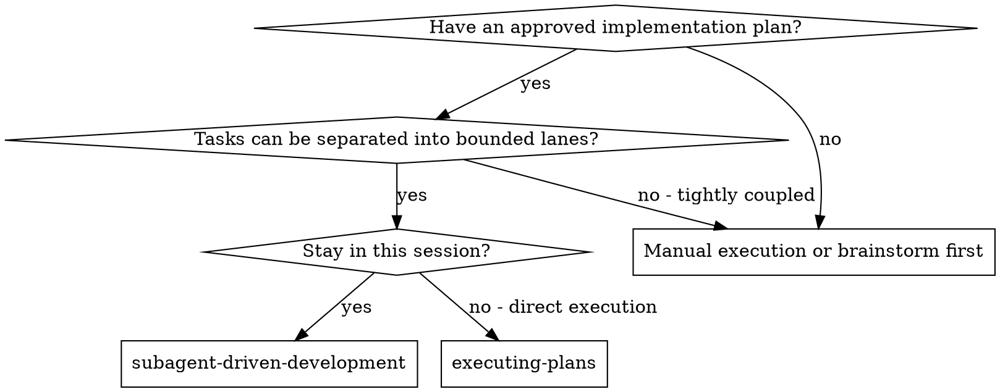

# Subagent-Driven Development

Execute an approved plan as dependency-aware lanes. With no workflow policy,
use a fresh implementer and two-stage review for each lane: spec compliance
first, then code quality. With an active policy, the tier-defined review rigor
is authoritative and selects which existing gates run.

When two or more plan tasks are ready and potentially safe to overlap, invoke
`joshix:dispatching-parallel-agents` to classify, schedule, and report them.
Keep one coordinator free to own shared context, questions, integration, and
fresh verification. Do not duplicate capacity, wave, fallback, or timing rules
in this skill.

The top-level coordinator follows
`../using-joshix/references/progress-dag.md`. Dispatched workers do not emit
DAGs. Do not duplicate the canonical threshold, state, styling, or update rules
here.

**Core principle:** Each lane owns a bounded scope. Under policy absence it
passes implementation, verification, spec review, and quality review before
its dependents advance. Under an active policy it passes the focused checks and
review gates selected by the task-level tier.

**Continuous execution:** Do not pause to check in with the human partner
between tasks. Continue until all authorized work is complete, a blocker or
ambiguity genuinely prevents progress, or the user interrupts with an honest
question that must be answered first.

## When to Use

```dot
digraph when_to_use {
    "Have an approved implementation plan?" [shape=diamond];
    "Tasks can be separated into bounded lanes?" [shape=diamond];
    "Stay in this session?" [shape=diamond];
    "subagent-driven-development" [shape=box];
    "executing-plans" [shape=box];
    "Manual execution or brainstorm first" [shape=box];

    "Have an approved implementation plan?" -> "Tasks can be separated into bounded lanes?" [label="yes"];
    "Have an approved implementation plan?" -> "Manual execution or brainstorm first" [label="no"];
    "Tasks can be separated into bounded lanes?" -> "Stay in this session?" [label="yes"];
    "Tasks can be separated into bounded lanes?" -> "Manual execution or brainstorm first" [label="no - tightly coupled"];
    "Stay in this session?" -> "subagent-driven-development" [label="yes"];
    "Stay in this session?" -> "executing-plans" [label="no - direct execution"];
}
```

## The Process

If a workflow policy is active, the coordinator reads
`../using-joshix/references/workflow-policy.md` and
`../using-joshix/references/autonomous-review.md`, and owns scope, active-time,
review-rigor, bounded passes, recording, and progress-transition checks.
Workers receive the declaration needed for their lane but never write shared
task context. Slices use focused checks; the coordinator reserves full
completion gates for the end after review sign-off. A trivial task stops before
pass two; every gate stops before pass three. `dev` disagreements are settled
and logged locally after one rebuttal; `policy` and `product` disagreements
bubble up.

1. Read the plan once; extract every task, `Depends on`, file/resource scope,
   verification command, and full task text.
2. Classify older tasks without `Depends on` conservatively.
3. Build the ready set from explicit dependencies and completed lane gates.
4. If two or more ready tasks may overlap safely, invoke
   `joshix:dispatching-parallel-agents`; otherwise run the ready task inline or
   serially.
5. Policy absent: for each lane, implementation and self-review → safe focused
   or deferred verification → spec-compliance review → code-quality review →
   fix and re-review loops.
6. Active policy: for each lane, run focused verification and only the existing
   review gates required by the task-level tier. Do not add the legacy
   two-stage lane review by default.
7. Do not advance a lane or its dependents while a selected review gate has
   open issues. Unrelated lanes may continue.
8. After every lane passes, run serial integration and the selected final
   whole-change review if the tier requires it. Run broad/full completion gates
   only once after review sign-off through
   `joshix:verification-before-completion`.

## Controller Rules

Create or update the task list from the one plan read. Give each worker the
complete task text and relevant scene-setting context; never make a worker read
the plan. Before dispatch, declare exclusive file and mutable-resource scope
and safe focused checks. Work in the current checkout and branch unless the
user explicitly requested a git operation.

Under policy absence, use a fresh role-specific worker for each lane's initial
implementation, spec review, and quality review. Under an active policy, keep
one task-scoped persistent reviewer peer across every selected plan, spec,
quality, and whole-change gate. Implementation workers remain lane-scoped.
Return findings to the same implementer when continuation is supported, then
resume the reviewer peer for the selected gate within the central cap.

Use these exact descriptions for lane dispatches so coordination and transcript
evidence do not depend on free-form summaries:

- Implementer: `Implement Task N: <task name>`
- Spec reviewer: `Spec review Task N: <task name>`
- Quality reviewer: `Quality review Task N: <task name>`
- Final reviewer: `Whole-change review: <plan or feature>`

Keep the complete role-specific prompt from the corresponding template; the
description is stable metadata, not a replacement for that prompt.

When the policy-absent workflow or active tier requires final review, use the
`joshix:requesting-code-review` template, replace
its generic dispatch description with the stable final-review description
above, and require exactly one final line:
`QUALITY OUTCOME: <APPROVED or CHANGES REQUIRED>`. Fix and re-review until the
outcome is `APPROVED`.

When an implementer returns, compare the files and mutable resources actually
touched with the declared scope before releasing dependents. Reviewer context
must include the lane's exact scope and lane-only change context, including
untracked files. Do not use an aggregate in-flight working-tree diff.

If a required broad or shared check was deferred, the coordinator owns it at
the first safe serialization point. The lane stays pre-review until the check
passes. On failure, classify it as lane-local or cross-lane, return it to the
responsible worker when continuation is supported (or dispatch a fully briefed
replacement), and repeat verification before review.

## Model Selection

Use the current/default model and reasoning effort for delegated work. Let host
inheritance cascade. Follow `joshix:dispatching-parallel-agents` for the
canonical inheritance rule and do not claim an effort level the host cannot
verify.

## Handling Implementer Status

Implementers report one of four statuses:

- **DONE:** Proceed to focused verification, then the next tier-selected review
  gate if policy is active, or spec-compliance review when policy is absent.
- **DONE_WITH_CONCERNS:** Correctness, scope, or verification concerns remain
  pre-review; observational concerns may proceed after coordinator judgment.
- **NEEDS_CONTEXT:** Resume the same worker when supported or dispatch a fully
  briefed replacement.
- **BLOCKED:** Stop the lane and descendants; unrelated authorized lanes may
  continue. Escalate when approved context cannot resolve the blocker.

A before-start or mid-work question pauses only its lane unless it challenges
shared scope, architecture, interfaces, or assumptions. Never ignore an
escalation or retry the same prompt without changing context or task shape.

## Prompt Templates

- `./implementer-prompt.md` - implementation and self-review
- `./spec-reviewer-prompt.md` - spec-compliance review
- `./code-quality-reviewer-prompt.md` - code-quality review after spec passes
  when policy is absent or both gates are selected; active policy may select
  the quality gate alone

## Policy-absent Example Workflow

An approved plan has four tasks:

- Task 1 establishes a shared test contract (`Depends on: None`).
- Tasks 2 and 3 depend on Task 1, own disjoint files and resources, and have
  safe focused checks.
- Task 4 integrates the result and depends on Tasks 2 and 3.

The coordinator runs Task 1 through implementation, verification, spec review,
and quality review. After that lane passes, Tasks 2 and 3 enter the ready set.
The coordinator invokes `joshix:dispatching-parallel-agents`, gives each
implementer exclusive scope and a focused check, and observes each return.

If Task 2 reaches spec review while Task 3 is still implementing, both lanes
continue independently. A quality finding in Task 2 loops back within Task 2;
it does not stop Task 3. Task 4 waits until both lane gates pass. The
coordinator then runs Task 4 and serial integration, followed by broad checks,
whole-change review, and fresh completion verification.

## Quality Gates

- Policy absent: keep spec-compliance review before code-quality review in every
  lane, and re-review until each gate passes.
- Active policy: run only tier-selected gates and use the central two-pass cap
  and disagreement protocol.
- Self-review never replaces a required independent review.
- Do not advance the same lane or its dependents while a selected review has
  open issues; unrelated lanes may proceed.
- Verify actual changed files and resources remain within declared scope.
- Preserve deferred checks for the first safe serialization point; never treat
  deferral as a pass.
- After all lanes pass, perform a final whole-change review only when the
  policy-absent workflow or active tier requires it.

## Red Flags

**Never:**

- Create or switch branches/worktrees unless the user explicitly requested it
- Under policy absence, skip spec-compliance or code-quality review
- When both gates are selected, start code-quality review before spec-compliance
  review passes
- Accept open findings without a fix and re-review loop
- Make a worker read the plan instead of providing full task text
- Dispatch a worker without exclusive file/resource scope and verification
  ownership
- Review the aggregate in-flight working-tree diff instead of one lane
- Ignore questions, concerns, scope drift, or deferred verification
- Treat `.joshix/specs/` or `.joshix/plans/` as permanent documentation after
  implementation
- Clean up unrelated `.joshix/` artifacts as incidental churn

## Integration

**Required workflow skills:**

- **joshix:writing-plans** - creates the dependency-annotated plan
- **joshix:dispatching-parallel-agents** - owns parallel classification,
  scheduling, shared-checkout safety, fallback, and reporting
- **joshix:requesting-code-review** - supplies the quality-review rubric
- **joshix:verification-before-completion** - requires fresh completion evidence

Implementers use **joshix:test-driven-development** for core behavior changes,
bug fixes, and other testable logic. Use **joshix:executing-plans** for direct
execution without subagent delegation.
