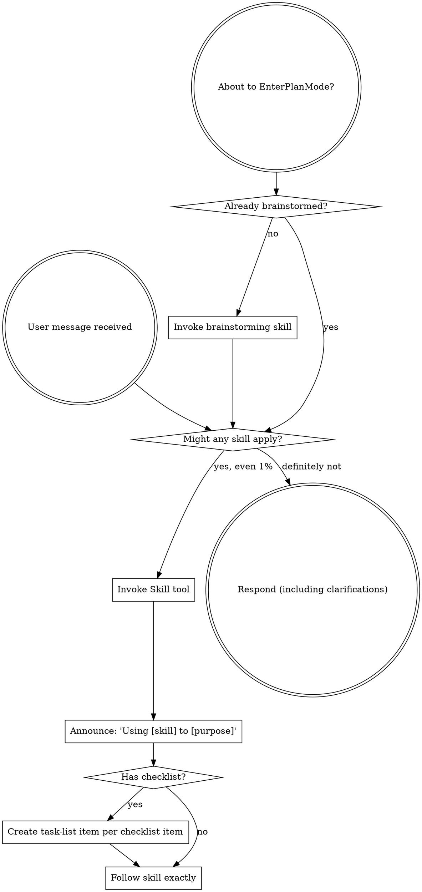

<SUBAGENT-STOP>
If you were dispatched as a subagent to execute a specific task, skip this skill.
</SUBAGENT-STOP>

<EXTREMELY-IMPORTANT>
If you think there is even a 1% chance a skill might apply to what you are doing, you ABSOLUTELY MUST invoke the skill.

IF A SKILL APPLIES TO YOUR TASK, YOU DO NOT HAVE A CHOICE. YOU MUST USE IT.

This is not negotiable. This is not optional. You cannot rationalize your way out of this.
</EXTREMELY-IMPORTANT>

## Instruction Priority

joshix skills override default system prompt behavior, but **user instructions always take precedence**:

1. **User's explicit instructions** (CLAUDE.md, GEMINI.md, AGENTS.md, direct requests) — highest priority
2. **joshix skills** — override default system behavior where they conflict
3. **Default system prompt** — lowest priority

If CLAUDE.md, GEMINI.md, or AGENTS.md says "don't use TDD" and a skill says to use TDD, follow the user's instructions. The user is in control.

## How to Access Skills

**In Claude Code:** Use the `Skill` tool. When you invoke a skill, its content is loaded and presented to you—follow it directly. Never use the Read tool on skill files.

**In Copilot CLI:** Use the `skill` tool. Skills are auto-discovered from installed plugins. The `skill` tool works the same as Claude Code's `Skill` tool.

**In Gemini CLI:** Skills activate via the `activate_skill` tool. Gemini loads skill metadata at session start and activates the full content on demand.

**In other environments:** Check your platform's documentation for how skills are loaded.

## Platform Adaptation

Skills use Claude Code tool names. Non-CC platforms: see `references/copilot-tools.md` (Copilot CLI), `references/codex-tools.md` (Codex) for tool equivalents. Gemini CLI users get the tool mapping loaded automatically via GEMINI.md.

# Using Skills

## The Rule

**Invoke relevant or requested skills BEFORE any response or action.** Even a 1% chance a skill might apply means that you should invoke the skill to check. If an invoked skill turns out to be wrong for the situation, you don't need to use it.

## Red Flags

These thoughts mean STOP—you're rationalizing:

| Thought | Reality |
|---------|---------|
| "This is just a simple question" | Questions are tasks. Check for skills. |
| "I need more context first" | Skill check comes BEFORE clarifying questions. |
| "Let me explore the codebase first" | Skills tell you HOW to explore. Check first. |
| "I can check git/files quickly" | Files lack conversation context. Check for skills. |
| "Let me gather information first" | Skills tell you HOW to gather information. |
| "This doesn't need a formal skill" | If a skill exists, use it. |
| "I remember this skill" | Skills evolve. Read current version. |
| "This doesn't count as a task" | Action = task. Check for skills. |
| "The skill is overkill" | Simple things become complex. Use it. |
| "I'll just do this one thing first" | Check BEFORE doing anything. |
| "This feels productive" | Undisciplined action wastes time. Skills prevent this. |
| "I know what that means" | Knowing the concept ≠ using the skill. Invoke it. |

## Skill Priority

When multiple skills could apply, use this order:

1. **Process skills first** (brainstorming, debugging) - these determine HOW to approach the task
2. **Implementation skills second** (frontend-design, mcp-builder) - these guide execution

"Let's build X" → brainstorming first, then implementation skills.
"Fix this bug" → debugging first, then domain-specific skills.

## Skill Types

**Rigid** (TDD, debugging): Follow exactly. Don't adapt away discipline.

**Flexible** (patterns): Adapt principles to context.

The skill itself tells you which.

## User Instructions

Instructions say WHAT, not HOW. "Add X" or "Fix Y" doesn't mean skip workflows.

## Honest Questions Before Action

If the user's message contains an honest question, answer the question before
making changes, running consequential tools, or continuing implementation.

A question is honest when the answer could affect scope, approach, priority, or
whether work should happen at all. Do not treat an honest question as approval
to proceed.

Rhetorical questions do not block action when the user also gives a clear
instruction. Example: "Who would do that? Do the other thing" means do the other
thing.

When unsure whether a question is honest or rhetorical, answer it and wait.

## Agent Workspace Artifacts

The `.agents/` directory is for agent coordination artifacts, not canonical
project documentation.

- `.agents/context/` is temporary local scratch context. It is ignored by git.
  Before creating a context file, scan existing files in `.agents/context/`.
  Start each context file with an ISO timestamp. Treat context files as
  scratchpads, not authoritative docs.
- `.agents/specs/` holds reviewed design specs while work is being planned or
  executed.
- `.agents/plans/` holds executable implementation plans while work is being
  executed.

Specs and plans are working artifacts. After implementation, durable decisions
belong in repo documentation, product docs, code comments, or other permanent
project files. Do not let `.agents/specs/` or `.agents/plans/` become stale
long-term documentation.

Clean up `.agents/context/` files older than 7 days only during explicit cleanup
work, not as incidental churn in unrelated changes.

## Git Workflow

Work in the current checkout and current branch by default, including `main`,
`master`, and `dev`. Do not stage, commit, create or switch branches, create
worktrees, merge, push, or open pull requests unless the user explicitly asks
for that git operation.

If the harness or the user already put you in a branch or worktree, use that
workspace as-is. Do not clean up branches or worktrees unless the user asks.
When the user does ask you to stage or commit, include only files intentionally
changed for the task unless they ask otherwise.
