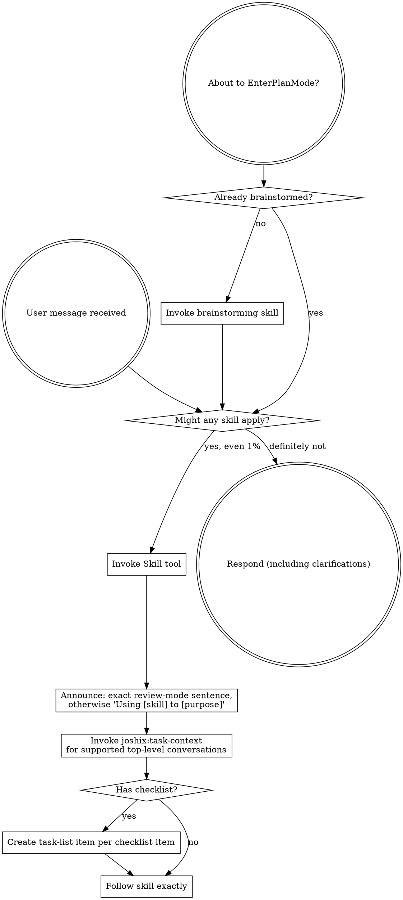

<SUBAGENT-STOP>
If the prompt declares a reviewer peer, skip top-level task-context
initialization and follow the read-only reviewer branch in `joshix:task-context`.
Other delegated workers never read or write top-level shared task context.
</SUBAGENT-STOP>

<TOP-LEVEL-TASK-CONTEXT>
For every top-level Codex or Claude conversation, invoke `joshix:task-context`
after the initial skill check and before substantive work, including for a
one-turn question. The task-context skill owns Git detection, routing, notices,
recording, and failure behavior. If the host requires commentary before the
initial tool call, preserve that exact commentary for task-context to append
after initialization.
</TOP-LEVEL-TASK-CONTEXT>

<WORKFLOW-POLICY>
When loaded repository guidance declares `joshix-workflow-policy:`, read and
follow `references/workflow-policy.md` before choosing ceremony, verification,
or review. The Work and review section below selects ceremony with or without
a policy; repository policy supplies additional risk-specific requirements.
</WORKFLOW-POLICY>

<EXTREMELY-IMPORTANT>
If you think there is even a 1% chance a skill might apply to what you are doing, you ABSOLUTELY MUST invoke the skill.

IF A SKILL APPLIES TO YOUR TASK, YOU DO NOT HAVE A CHOICE. YOU MUST USE IT.

This is not negotiable. This is not optional. You cannot rationalize your way out of this.
</EXTREMELY-IMPORTANT>

If an invoked skill turns out to be wrong for the situation, you don't need to use it.

<EXTREMELY-IMPORTANT>
First identify what the reviewer evaluated. Use artifact reception only for a
concrete code or diff artifact, a named plan, or a named spec. Task history,
`current.md`, product discussion, proposed architecture, and general chat are
context, not review artifacts. Feedback about those subjects receives a normal
conversational response even when the request says “read the shared chat and
respond to the review.” The phrase `review` alone does not select artifact reception.

For a concrete artifact, if the current user message includes code review
feedback, review comments, a pasted agent review, or critique of code changes,
or if it includes plan or spec reviewer feedback, identify whether the review
concerns code, a plan, or a spec. Invoke `joshix:receiving-code-review` for code,
`joshix:receiving-plan-review` for plans, and
`joshix:receiving-spec-review` for specs. Invoke the matching reception skill
before any implementation skill, TDD step, file edit, or test-writing step.

Read and follow `references/review-reception-contract.md` and
`references/review-response-format.md` completely. Receiving another agent's
code, plan, or spec review enters automatic meta-review mode by role. The first
reference is the single decision table for edit authority, owner gates,
continuation, convergence, and failure; the second is the single response
grammar, including semantic explicit no-edit openings. Do not restate or infer
variants of either contract.

The explicit no-edit opening must be known before the first skill-loading tool
call, so this bootstrap owns its exact text. In that mode, use the matching
sentence below as the first emitted agent sentence; do not prepend a generic
skill announcement:

- Code: `I'm reviewing the review as feedback to evaluate, not as approval to edit files.`
- Plan: `I'm reviewing the plan review as feedback to evaluate, not as approval to edit the plan.`
- Spec: `I'm reviewing the spec review as feedback to evaluate, not as approval to edit the spec.`

Use this exception only when the user semantically says review only, do not
edit, do not apply, or keep the artifact unchanged. `What do you think?`,
`Thoughts?`, and `Is this right?` merely request meta-review; they remain
automatic and must never trigger the no-edit opening.

For non-artifact discussion feedback, use normal prose: state agreement or
disagreement, the resulting design, and any genuine unresolved decision. Do
not use artifact validity labels or artifact-response headings. If the
discussion settles a plan whose execution still requires the owner's command,
end with the plain exact execution readiness hold; never fabricate a decision
memo. Continue from spec to plan after required reviews and genuine decisions
unless the user explicitly requested a stop.
</EXTREMELY-IMPORTANT>

## Instruction Priority

joshix skills override default system prompt behavior, but **user instructions always take precedence**:

1. **User's explicit instructions** (CLAUDE.md, GEMINI.md, AGENTS.md, direct requests) — highest priority
2. **joshix skills** — override default system behavior where they conflict
3. **Default system prompt** — lowest priority

If CLAUDE.md, GEMINI.md, or AGENTS.md says "don't use TDD" and a skill says to use TDD, follow the user's instructions. The user is in control.

## How to Access Skills

**In Claude Code:** Use the `Skill` tool. When you invoke a skill, its content is loaded and presented to you—follow it directly. Never use the Read tool on skill files.

**In Copilot CLI:** Use the `skill` tool. Skills are auto-discovered from installed plugins. The `skill` tool works the same as Claude Code's `Skill` tool.

**In Gemini CLI:** Skills activate via the `activate_skill` tool. Gemini loads skill metadata at session start and activates the full content on demand.

**In other environments:** Check your platform's documentation for how skills are loaded.

## Platform Adaptation

Skills use Claude Code tool names. Non-CC platforms: see `references/copilot-tools.md` (Copilot CLI), `references/codex-tools.md` (Codex) for tool equivalents. Gemini CLI users get the tool mapping loaded automatically via GEMINI.md.

# Using Skills

```dot
digraph skill_flow {
    "User message received" [shape=doublecircle];
    "About to EnterPlanMode?" [shape=doublecircle];
    "Already brainstormed?" [shape=diamond];
    "Invoke brainstorming skill" [shape=box];
    "Might any skill apply?" [shape=diamond];
    "Invoke Skill tool" [shape=box];
    "Announce: exact review-mode sentence,\notherwise 'Using [skill] to [purpose]'" [shape=box];
    "Invoke joshix:task-context\nfor supported top-level conversations" [shape=box];
    "Has checklist?" [shape=diamond];
    "Create task-list item per checklist item" [shape=box];
    "Follow skill exactly" [shape=box];
    "Respond (including clarifications)" [shape=doublecircle];

    "About to EnterPlanMode?" -> "Already brainstormed?";
    "Already brainstormed?" -> "Invoke brainstorming skill" [label="no"];
    "Already brainstormed?" -> "Might any skill apply?" [label="yes"];
    "Invoke brainstorming skill" -> "Might any skill apply?";

    "User message received" -> "Might any skill apply?";
    "Might any skill apply?" -> "Invoke Skill tool" [label="yes, even 1%"];
    "Might any skill apply?" -> "Respond (including clarifications)" [label="definitely not"];
    "Invoke Skill tool" -> "Announce: exact review-mode sentence,\notherwise 'Using [skill] to [purpose]'";
    "Announce: exact review-mode sentence,\notherwise 'Using [skill] to [purpose]'" -> "Invoke joshix:task-context\nfor supported top-level conversations";
    "Invoke joshix:task-context\nfor supported top-level conversations" -> "Has checklist?";
    "Has checklist?" -> "Create task-list item per checklist item" [label="yes"];
    "Has checklist?" -> "Follow skill exactly" [label="no"];
    "Create task-list item per checklist item" -> "Follow skill exactly";
}
```

## Red Flags

These thoughts mean STOP—you're rationalizing:

| Thought | Reality |
|---------|---------|
| "This is just a simple question" | Questions are tasks. Check for skills. |
| "I need more context first" | Skill check comes BEFORE clarifying questions. |
| "Let me explore the codebase first" | Skills tell you HOW to explore. Check first. |
| "I can check git/files quickly" | Files lack conversation context. Check for skills. |
| "Let me gather information first" | Skills tell you HOW to gather information. |
| "This doesn't need a formal skill" | If a skill exists, use it. |
| "I remember this skill" | Skills evolve. Read current version. |
| "This doesn't count as a task" | Action = task. Check for skills. |
| "The skill is overkill" | Simple things become complex. Use it. |
| "I'll just do this one thing first" | Check BEFORE doing anything. |
| "This feels productive" | Undisciplined action wastes time. Skills prevent this. |
| "I know what that means" | Knowing the concept ≠ using the skill. Invoke it. |

## Skill Priority

When multiple skills could apply, use this order:

1. **Process skills first** (brainstorming, debugging) - these determine HOW to approach the task
2. **Implementation skills second** (frontend-design, mcp-builder) - these guide execution

"Let's build X" → brainstorming first, then implementation skills.
"Fix this bug" → debugging first, then domain-specific skills.

Rigid skills are exact; flexible skills adapt their principles to context.

## User Instructions

Instructions say WHAT, not HOW. "Add X" or "Fix Y" doesn't mean skip workflows.

## Browser testing

Use an isolated headless browser for automated testing by default.

Do not use Josh's live browser, existing tabs, personal profile, cookies, or
login for testing unless he explicitly requests that browser session. A general
request to test an app does not grant that permission. Do not copy his browser
profile or login into a test session to bypass this rule.

If a check requires a visible browser, use a separate test browser/profile.
A hidden tab is not proof of isolation. Missing test authentication, unavailable
headless tooling, or a failed isolated run never authorizes a live-browser
fallback. Use independent test authentication when available; otherwise report
the concrete blocker and which checks remain unverified.

This rule governs automated testing. It does not change user-requested previews
or the brainstorming visual companion. Explicit live-session requests remain
limited to the requested tabs and actions.

## Owner questions

Never put an owner question on a timer, in text or in a question dialog. Once
you ask, elapsed time or an unanswered tool return cannot select an answer or
unblock dependent work; follow the waiting rules below regardless of formatting.

For genuine owner decisions, read and follow
`references/owner-question-format.md`. It owns the literal rendered template,
spacing, choices, dialogs, and waiting without timed defaults.

## Work and review

Follow the user's current phase. Product discussion stays discussion; answering
a design question does not authorize implementation preparation. Visual
experimentation stays a preview until the user requests completion or accepts
the direction and authorizes finishing. Extending a preview does not start
completion review. Explicit requests to review a spec, plan, or code still use
the matching review skill.

For an understood repair, write one short plan only when useful, implement,
prove the intended result, and review the completed change. An isolated,
disposable experiment may run before planning or review: state the question,
run the smallest safe check, then use its evidence to decide what to retain.
Neither path relaxes permissions, isolation, repository-required checks, or
review of retained changes. Do not label a production change an experiment to
avoid its requirements.

Request advance spec or plan review for consequential unresolved product or
architecture choices, or when the owner or repository explicitly requires
that review. A plan file, file count, or task count alone does not require it.
Preserve tier-required gates. Required review needs approval or an explicit
owner override of that review; an unresolved defect is not approval. A settled
short plan needs self-review, not a waiver of an otherwise unnecessary gate.

Prove the main user outcome early with the cheapest meaningful test or
inspection, before expanding edge-case detail. Preserve that proof through
corrections. Use source inspection or a bounded experiment to settle technical
uncertainty instead of repeatedly elaborating speculative plan prose. Review
reception and affected-path checks follow `references/review-reception-contract.md`.

## Questions and continuation

Answer substantive questions before consequential action. If the answer leaves
a real owner choice unresolved, wait for that choice; a discussion answer is
not execution approval. A status question or interruption does not cancel
previously authorized work. Establish whether an interrupted action ran before
retrying, then continue safely within the existing authorization. Never infer
success or duplicate an external action whose outcome is uncertain.

Carry settled decisions and accepted limitations in the existing task context;
do not ask them again without new evidence. Report what changed, what remains
unproven, and the next action. Avoid repeated unchanged review-wait messages.

Questions merely soliciting meta-review follow the reception contract.

## Plan Documents Default To Review

If the user provides, pastes, links, or references an implementation plan
without an explicit execution instruction, treat it as a plan review request.
Invoke `joshix:reviewing-plans` and do not edit files, implement tasks, stage,
commit, branch, or start execution.

Execution requires explicit language such as "execute this plan", "implement
this", "start on it", "apply this plan", "carry this out", or "get this done".
A bare plan, "here is the plan", or "final plan" is not approval to execute.

## Spec Documents Default To Review

If the user supplies, pastes, links, or references a design spec without an
explicit instruction to edit the spec or execute implementation work, invoke
`joshix:reviewing-specs` and remain read-only. Treat direct requests to review,
audit, sanity-check, validate, or critique a spec the same way.

Do not edit the spec or execute implementation unless the user explicitly asks
for that action. Received spec-review feedback is different: it takes
precedence over this producer route and invokes `joshix:receiving-spec-review`
under the review-feedback rules below.

## Agent Workspace Artifacts

The `.joshix/` directory is for agent coordination artifacts, not canonical
project documentation.

- `.joshix/context/` is temporary local scratch context. It is ignored by git.
  Before creating a context file, scan existing files in `.joshix/context/`.
  Start each context file with an ISO timestamp. Treat context files as
  scratchpads, not authoritative docs.
- `.joshix/specs/` holds reviewed design specs while work is being planned or
  executed.
- `.joshix/plans/` holds executable implementation plans while work is being
  executed.

Specs and plans are working artifacts. After implementation, durable decisions
belong in repo documentation, product docs, code comments, or other permanent
project files. Do not let `.joshix/specs/` or `.joshix/plans/` become stale
long-term documentation.

Clean up `.joshix/context/` files older than 7 days only during explicit cleanup
work, not as incidental churn in unrelated changes.

## Git Workflow

Work in the current checkout and current branch by default, including `main`,
`master`, and `dev`. Do not stage, commit, create or switch branches, create
worktrees, merge, push, or open pull requests unless the user explicitly asks
for that git operation.

If the harness or the user already put you in a branch or worktree, use that
workspace as-is. Do not clean up branches or worktrees unless the user asks.
When the user does ask you to stage or commit, include only files intentionally
changed for the task unless they ask otherwise.
