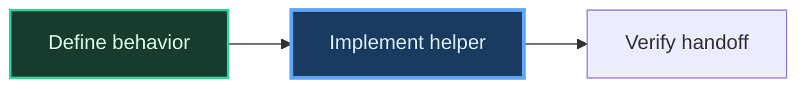

# Progress DAG

This is the canonical progress-visualization policy for joshix planning and
development workflows.

## Trigger

Render a Mermaid progress DAG when the top-level workflow has an active tracked
task list with at least three tracked nodes. The tracked list is the trigger;
do not estimate whether work feels “substantial.” Ordinary questions and one-
or two-node work do not get a DAG.

## Ownership

The top-level coordinator renders the DAG for Josh. Dispatched workers never
render, update, or persist it. Worker findings change the coordinator's tracked
state; the coordinator presents the next user-facing graph.

## Render times

Render the graph:

- When qualifying planning or execution begins.
- When tracked node state changes.
- When a blocker changes dependencies or the viable path.
- At completion.

Do not re-render an unchanged graph merely because another commentary message
is due.

## Stable topology and state

- Keep node IDs and labels stable between updates.
- Show actual dependencies and available parallelism instead of forcing a line.
- Condense large plans into meaningful phase nodes when the full task list is
  hard to read.
- Completed nodes use `done`; in-flight nodes use `active`.
- Do not assign a class to todo nodes, so they retain Mermaid's regular/default
  styling.
- Define the state classes in every emitted graph:



At completion, all completed nodes receive `done` and no node remains `active`.

## Shared-context boundary

The DAG is a user-facing conversation update. If shared task context is active,
the visible response containing it is recorded like any other outward-facing
message. Do not write the DAG as shared task state, do not add a separate
diagram file, and do not use an old DAG instead of the active plan and
`current.md`.

## Render and inspect

For every qualifying DAG update, keep the Mermaid source fence in the response
and also render an additive PNG on both Claude Code and Codex. Create a unique
temporary directory with `mktemp -d`; do not persist the PNG in task context or
Git.

```sh
render_dir="$(mktemp -d)"
node <absolute-using-joshix-skill-dir>/scripts/render-mermaid.mjs --output "$render_dir/progress-dag.png" <<'MERMAID'
flowchart LR
  %% generated Mermaid graph with done/active/todo classes
MERMAID
```

Inspect the printed absolute PNG path. Present that local image in Codex where
supported; inspect it with the image tool in Claude Code; then discard the
temporary directory. If the inspected graph is not legible at the available
viewing size, condense it into meaningful phase nodes or change the layout
direction to make it readable.
